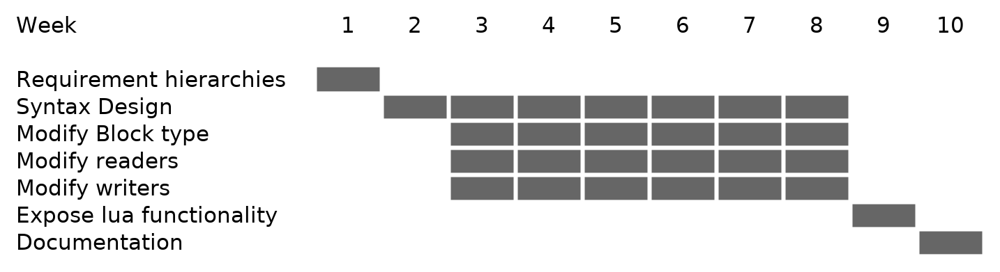

<!--
Your title should be short, clear and interesting. The job of the title is to
convince the reviewer to read your synopsis.
-->


<!--
Putting your full name on the proposal is not enough. Provide full contact
information, including email addresses, websites, IRC nick, and telephone
number.
-->

# Synopsis

![Example Figure.[@multi-fig]\label{fig:multi}](multi-example.png)

<!--
If the format allows, start your proposal with a short summary, designed to
convince the reviewer to read the rest of the proposal.
-->

Figures play a central role in the life cycle of all kinds of research and
analysis. That is: *The communication of results*.

Often, those results require complex figures as the one shown in Figure
\ref{fig:multi}. This example shows a figure that is composed of two sub
figures. Each one with its own caption and a larger caption for the total
figure. That last caption has references to the sub figures.

\break
The above figure is generated by the following LaTeX code:

\tiny
```{.tex}
\begin{figure}[!htbp]
    \centering
    \begin{subfigure}[b]{0.5\textwidth}
        %\includegraphics[width=7.5cm, height=5.5cm]{Indian_foils_H20.pdf}
        \includegraphics[width=7.5cm, height=5.5cm]{figures/GEM/figures/Fig_11(a).pdf}
        \caption{ }
        \label{fig:Indian_foils_H20}
    \end{subfigure}
    \begin{subfigure}[b]{0.46\textwidth}
        %\includegraphics[width=7.5cm, height=5.5cm]{CERN_foils.pdf} 
        \includegraphics[width=7.5cm, height=5.5cm]{figures/GEM/figures/Fig_11(b).pdf} 
        \caption{ }
        \label{fig:CERN_foils}
    \end{subfigure}
   \caption{Leakage Current of (a) Micropack Foils and (b) CERN Foils, at an
   average temperature of T=27$^{\circ}$C and relative humidity equal to 20\%.}
   \label{fig:L_01}
\end{figure}
```
\normalsize

What we propose in this project is to **enhance `pandoc`'s figure handling
capabilities** to represent similar figures, captions and references. This will
enable `pandoc` to, for example, convert the previous code to HTML among other
formats.

Furthermore we propose **using markdown syntax** to represent this composite
figure. This, we hope, will require less boilerplate code than LaTeX to achieve
the same result.

<!--
* Importance of communicating results of research/analysis

> The life cycle of Data science can never be completed without communicating
> the results of the analysis/research.

* Importance of searchable source formats.

* Single source publishing https://en.wikipedia.org/wiki/Single-source_publishing

-->

# Benefits to the Community

We believe the community will benefit by:

## Having a concise syntax for complex figures

`Pandoc` is an integral part of R Markdown used by many scientists. It is also
being used for the production of academic journals, e.g. JOSS,
kommunikation@gesellschaft.

This project would provide those users with a more concise way to communicate
their results using multiple figures.

## Facilitating single source publishing

In [single source
publishing](https://en.wikipedia.org/wiki/Single-source_publishing), one single
document is used to create different forms of media (*e.g*: pdf, html).

The implementation of this project would mean that content creators will have to
revert to LaTeX (or other markup) less often. Making their source document more
readable and consistent.

<!--
Don’t forget to make your case for a benefit to the organization, not just to
yourself. Why would Google and your organization be proud to sponsor this work?
How would open source or society as a whole benefit? What cool things would be
demonstrated?
-->


<!--
Include a brief, clear work breakdown structure with milestones and deadlines.
Make sure to label deliverables as optional or required. You may want your plan
to start by producing some kind of white paper, or planning the project in
traditional Software Engineering style. It’s OK to include thinking time
(“investigation”) in your work schedule. Deliverables should include
investigation, coding and documentation.

A deliverable is a tangible or intangible good or service produced as a result
of a project that is intended to be delivered to a customer (either internal or
external). A deliverable could be a report, a document, a software product, a
server upgrade or any other building block of an overall project.

-->

# Project description

## Brief introduction to pandoc

`Pandoc`  is  a  Haskell library for converting from one markup format to another,
and a command-line tool that uses this library.

`Pandoc` can convert between numerous markup and word processing formats,
including, but not limited to,  various  flavors of Markdown, HTML, LaTeX and
Word docx.

`Pandoc`’s enhanced version of Markdown includes syntax for tables, definition
lists,  metadata  blocks,  footnotes, citations, math, and much more.


`Pandoc`  has a modular design: it consists of a set of readers, which parse
text in a given format and produce a native representation of the document (an
abstract syntax tree or AST), and a set of writers, which convert this native
representation into a target format (Figure \ref{fig:native-rep}).  Thus, adding an input or
output format requires only adding a reader or writer.  Users can also run
custom `pandoc` filters to modify the intermediate AST.[@pandoc-guide]

## Goals

The objective of this project is to augment `pandoc`'s figure handling
capabilities by:

* **Providing explicit handling**: `pandoc`'s currently represents figures as an
  image in its own paragraph[@figure-issue]. This has been sufficient for basic
  figure handling but more detailed figure manipulation will probably require a
  new constructor in the native representation.

* **Implementing more functionality**: In particular: multiple figure
  arrangement, labeling and referencing.

* **Expose the new functionality to the Lua filters**: This will enable end users
  to  add figure support to formats that don't support them natively, like
  Markdown.

## Methodology

The way we propose to enhance `pandoc`'s figure handling capabilities is to
start by extending the *native representation* to better describe figures. This
is something the current version does but only in a limited fashion
[@figure-issue].

To that end, we'll research and design a way to leverage markdown syntax to
describe, for example, a figure composed of various smaller figures.

Once that design is done and test cases have been produced, we'll start
implementing the extension in the native representation and extending the
*readers* and *writers* to make use of it. We intend this to be an iterative process
from designing the constructor to its use in the *writer* going back and forth as
we extend the capabilities.

We plan to use Haskell's extension `PatternSynonyms` to decouple the data structure
that stores the figure information from how it is consumed and produced by the
*writers* and *readers* respectively. [@patternSyn]

In the final phase of the project we want to expose the new functionality to
`pandoc`'s Lua interface so that users can, for example, write custom combined
figures output for a particular format.

## Project timeline.\label{sec:timeline}

These are the planned stages to complete the project. Figure \ref{fig:gannt}
shows the allocated time per activity. The activities are detailed next.



<!-- Extra section I added -->


<!--
Community Bonding: May 17 June 7
Coding start: June 7
Coding End: August 16

                               2021

         June                  July                  August
 Su Mo Tu We Th Fr Sa  Su Mo Tu We Th Fr Sa   Su Mo Tu We Th Fr Sa
        1  2  3  4  5               1  2  3    1  2  3  4  5  6  7
  6 [7] 8  9 10 11 12   4  5  6  7  8  9 10    8  9 10 11 12 13 14
 13 14 15 16 17 18 19  11 12 13 14 15 16 17   15[16]17 18 19 20 21
 20 21 22 23 24 25 26  18 19 20 21 22 23 24   22 23 24 25 26 27 28
 27 28 29 30           25 26 27 28 29 30 31   29 30 31

There are 10 weeks -->

### Requirement gathering and prioritization.

This is deciding in a hierarchy of features that we would like to implement
first(composition, labeling, referencing). Always in the context of enhancing
the figure handling capabilities
of `pancoc`.

### Deciding on a syntax for markdown documents and creating test cases.

Once the first priorities have been defined we'll devise a way to use  markdown
syntax to represent the enhanced figure capabilities. Like: Composing figures.
For this we'll take inspiration from HTML and LaTex.

Only existing Markdown constructs will be used at first: this way, we'll be able
to use filters to create a figure without having to modify the Markdown parser.

This also includes deciding on `pandoc`'s output for HTML and LaTeX.

**Deliverables**: the markdown syntax, the tests, the output.

<!-- ## Creating files on how that syntax should be interpreted (html, tex) -->

### Add a constructor to the native representation that represents figures.{#sec:new-constructor}

Based on the syntax and the feature. This is the time to design the data
structure that will hold the information needed. This structure has to play
along well with the ones already defined in `pandoc`'s internal data
representation.

This also takes into account other formats for inspiration. HTML, LaTeX, etc...
As well as previous work [@figure-constructor].

This is an internal **deliverable** since, once created, the structure can be
used in the future in *Readers* and writers.

### Modify the *Readers* to use that constructor

Once the destination data structure has been decided, we'll have to extract the
information from the source file and store it in it.

Haskell's `PatternSynonyms`, to a certain extent, allow us to decouple this
process of extraction from the native representation.

This is an internal **deliverable** since, once created by the *Reader*, the
result in the internal representation can be used by *Writers* written in the
future.

### Modify the *Writers* (`html`, `LaTeX`) to use that constructor.

This means to transform the native presentation to a target output format.

Again we hope Haskell's `PatternSynonyms` will permit, to a certain extent, to
decouple this transformation from the source data structure.

This is an internal **deliverable** as this can consume the internal
representation provided by other *Writers*. The output of the *writers* is what
ultimately produces the functionality observed by the end users.

### Iterate the design until the results are deemed satisfactory.

We propose implementing the features iteratively adding them in the order as
they were deemed important in the first phase.

### Expose functionality to the Lua filters.

With this, end users could add figure support to formats that don't support them
natively, like Markdown.

This will require researching the filter's implementation and usage to decide
the best way to expose the functionality.

### Write Documentation

Write documentation of the implemented features that are exposed to end users.

## Detailed Deliverables

As detailed in the previous section:

* A new constructor in the `Block` type(the native representation) to represent a figure.
* A new markdown syntax extension to represent more complex figures in `pandoc`.
* New versions of the HTML and markdown readers that produce the new constructor.
* New versions of the HTML and `LaTeX` writers that use the new constructor.
* `Lua` bindings for the new functionality.
* Documentation of the features.

# Related Work

There have been proposals for this constructor before [@figure-constructor]
which are considered in the implementation of this  project. Together with
`pandoc`'s native representation of tables [@tables].

# About me

## With respect to pandoc and this project

I've already worked with `pandoc`'s code base.  I've also used `pandoc` to
generate documents in both work and academic situations.

### Adding support for figures in the asciiDoc format.

In this [pull request](https://github.com/jgm/pandoc/pull/6671).

* I added support for figures in the `asciiDoc` format by modifying the relevant
  *writer*.

* Updated the relevant tests for the new functionality.

This was marked as a *Good first issue* on GitHub and was how I became familiar
with `pandoc`'s code base and basic architecture.

### Changing the default style for markdown headings

In these pull requests
[[1](https://github.com/jgm/pandoc/pull/6693),
[2](https://github.com/jgm/pandoc/pull/6837)]. I changed the default markdown
headings format from `Setext`:

```
Setext Heading Style
====================
```

to `atx`

```
# ATX Heading Style
```

As markdown is involved in various other formats, like `iPyhon`, literate
Haskell, etc..., this involved work in various *readers* and *writers* as well as
changing many test cases.

## With respect to Haskell

I wrote my solutions to the Advent of code 2020 edition
[code](https://github.com/argent0/adventOfCode2020/) using Haskell. I like
Haskell and Functional Programming.


## Contact Information

Redacted

## Professional

* Github: https://github.com/argent0
* Linkedin: https://www.linkedin.com/in/aner-lucero-3778bb42/

## Skills

* Languages: Haskell, R, Python, Perl, Bash, Awk, C, C++, Java.

## Education

Master’s degree in Physics: At Instituto Balseiro, Universidad Nacional de
Cuyo. Thesis title: “Caracterización del mapeo entrada salida en Neuronas
Individuales”. Directed by: Dr. Inés Samengo. From 2006 to 2007

Bachelor’s degree in Physics: At Instituto Balseiro, Universidad Nacional de
Cuyo. Thesis title: “Caracterización del mapeo entrada salida en Neuronas
Individuales”. Directed by: Dr. Inés Samengo. This work was continued in the
master’s degree. From 2004 to 2006

Enrolled in the Bachelor's degree of computer science at Universidad Nacional de
Cuyo since 2019,

<!--
You should understand and communicate other people’s work that may be related to
your own. Do your research, and make sure you understand how the project you are
proposing fits into the target organization. Be sure to explain how the proposed
work is different from similar related work.
-->

# Bibliography

<!--
Keep your personal info brief. Be sure to communicate personal experiences and
skills that might be relevant to the project. Summarize your education, work,
and open source experience. List your skills and give evidence of your
qualifications. Convince your organization that you can do the work. Any
published work, successful open source projects and the like should definitely
be mentioned.
-->

::: {#refs}
:::
